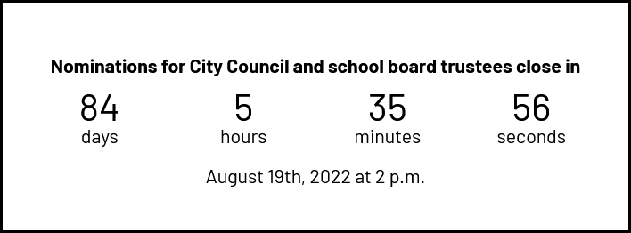

# Countdown Clock



A simple countdown clock for embedding on the City website.

## Usage

```html
<iframe
  src="https://cityssm.github.io/countdown-clock/?config=canada-day"
  title="Countdown to Canada Day"
  style="width:100%;height:300px"></iframe>
```

## Sample Countdown Clocks

-   [Canada Day](https://cityssm.github.io/countdown-clock/?config=canada-day)
-   [2022 Municipal Election Nomination Period](https://cityssm.github.io/countdown-clock/?config=2022-election-nominations)
-   [2022 Municipal Election Day](https://cityssm.github.io/countdown-clock/?config=2022-election-day)
